# Kiến trúc pipeline — Lab Day 10

**Nhóm:** nhóm 04 — 403 (data-engineering)  
**Cập nhật:** 2026-04-15

---

## 1. Sơ đồ luồng

```mermaid
flowchart LR
    subgraph Ingest
        A["CSV raw export<br/>(data/raw/*.csv)"]
    end

    subgraph Transform["Transform (cleaning_rules.py)"]
        B["Load CSV<br/>load_raw_csv()"]
        C["Allowlist doc_id"]
        D["Normalize effective_date<br/>(DD/MM/YYYY → ISO)"]
        E["Quarantine HR stale<br/>(&lt;2026-01-01)"]
        F["Quarantine empty<br/>chunk_text / date"]
        G["R8: Quarantine<br/>migration notes"]
        H["R9: Validate<br/>exported_at ISO"]
        I["Deduplicate<br/>chunk_text"]
        J["Fix refund<br/>14→7 ngày"]
        K["R7: Strip<br/>[cleaned:...] tags"]
    end

    subgraph Quality["Quality (expectations.py)"]
        L["E1-E6: Baseline<br/>expectations"]
        M["E7: No migration<br/>notes (halt)"]
        N["E8: exported_at<br/>within 30d (warn)"]
    end

    subgraph Embed["Embed (ChromaDB)"]
        O["Prune stale IDs<br/>(prev - current)"]
        P["Upsert by<br/>chunk_id"]
    end

    subgraph Monitor["Monitor"]
        Q["Manifest JSON<br/>(run_id, timestamps)"]
        R["Freshness SLA<br/>check (24h)"]
    end

    subgraph Output["Artifacts"]
        S["cleaned_*.csv"]
        T["quarantine_*.csv"]
        U["run_*.log"]
    end

    A --> B --> C --> D --> E --> F --> G --> H --> I --> J --> K
    K --> S
    C & D & E & F & G & H & I -->|quarantine| T
    S --> L --> M --> N
    N -->|halt?| V{HALT}
    V -->|no| O --> P
    V -->|yes & skip-validate| O
    V -->|yes| W["PIPELINE_HALT"]
    P --> Q --> R
    B --> U
```



### Luồng chạy end-to-end

```bash
# Cài đặt
pip install -r requirements.txt
cp .env.example .env

# Chạy pipeline (ingest → clean → validate → embed)
python etl_pipeline.py run --run-id <run_id>

# Kiểm tra freshness
python etl_pipeline.py freshness --manifest artifacts/manifests/manifest_<run_id>.json

# Đánh giá retrieval
python eval_retrieval.py --out artifacts/eval/eval_<run_id>.csv
```

---

## 2. Ranh giới trách nhiệm

| Thành phần | Input | Output | Owner nhóm |
|------------|-------|--------|------------|
| **Ingest** | `data/raw/policy_export_dirty.csv` (CSV export từ CMS/API) | List[Dict] raw rows | Ingestion / Raw Owner |
| **Transform** | Raw rows | `cleaned_*.csv` + `quarantine_*.csv` | Cleaning & Quality Owner |
| **Quality** | Cleaned rows | ExpectationResult[] + halt decision | Cleaning & Quality Owner |
| **Embed** | Cleaned CSV | ChromaDB collection `day10_kb` (upsert + prune) | Embed & Idempotency Owner |
| **Monitor** | Manifest JSON | Freshness PASS/WARN/FAIL + `run_*.log` | Monitoring / Docs Owner |

---

## 3. Idempotency & rerun

### Strategy: Snapshot Publish

Pipeline sử dụng **upsert + prune** để đảm bảo idempotent:

1. **Upsert by `chunk_id`** (`col.upsert(ids=ids, ...)`): Cùng `chunk_id` → ghi đè document + metadata. Không tạo duplicate vector.

2. **Prune stale IDs** (`prev_ids - set(ids)` → `col.delete(ids=drop)`): Sau mỗi run, IDs không còn trong cleaned output bị xóa khỏi ChromaDB. Collection luôn = snapshot cleaned hiện tại.

3. **`chunk_id` stable hash**: `chunk_id = f"{doc_id}_{seq}_{sha256[:16]}"` — deterministic, cùng input → cùng ID.

**Rerun 2 lần cùng input:**
- Lần 1: upsert N chunks, prune M stale IDs
- Lần 2: upsert N chunks (ghi đè identical), prune 0 IDs
- Kết quả: **identical** — không duplicate, không mất dữ liệu

**Bằng chứng từ log:**
```
# corrupted → clean (7 chunks bẩn → 5 chunks sạch):
# Log run_clean.log:
embed_prune_removed=6    ← xóa 6 ID cũ từ run corrupted (2 chunk lỗi + 4 khác hash)
embed_upsert count=5     ← ghi 5 chunk sạch

# Rerun clean lần 2 sẽ cho:
embed_upsert count=5     ← ghi đè identical
# (không prune vì IDs khớp)
```

---

## 4. Liên hệ Day 09

Pipeline Day 10 **cung cấp và làm mới corpus** cho RAG retrieval trong Day 08/09:

- **Cùng `data/docs/`**: Các file txt gốc (`policy_refund_v4.txt`, `sla_p1_2026.txt`, ...) là canonical source dùng chung
- **Export riêng qua CSV**: Day 10 thêm lớp ETL (clean → validate → embed) trước khi đưa vào ChromaDB, thay vì embed trực tiếp từ file txt
- **ChromaDB collection `day10_kb`**: Multi-agent system từ Day 09 có thể query collection này thay vì embed riêng, nhận được dữ liệu đã qua quality gate
- **Giá trị gia tăng**: Day 09 embed từ raw txt → có thể chứa stale/duplicate. Day 10 đảm bảo chỉ chunk sạch, đúng version, đúng format mới vào vector store

---

## 5. Rủi ro đã biết

- **Freshness SLA luôn FAIL** với dữ liệu mẫu (exported_at cố định = 2026-04-10). Cần CMS/API export tự động để có dữ liệu fresh
- **Chunk overlap semantic**: Hai chunk có nội dung gần giống nhau nhưng khác text literal sẽ qua dedup → có thể gây retrieval noise
- **Single collection**: Tất cả doc_id chia sẻ một ChromaDB collection. Nếu scale lên nhiều domain, cần partition hoặc multi-collection
- **Embedding model**: `all-MiniLM-L6-v2` là model nhẹ, chưa tối ưu cho tiếng Việt. Production nên dùng multilingual model
- **R7 strips tag SAU refund fix**: Nếu refund fix thêm tag `[cleaned: ...]` rồi R7 strip → chunk_id hash thay đổi so với lần trước (vì text thay đổi) → prune xóa ID cũ, upsert ID mới. Đây là behavior đúng nhưng cần lưu ý khi debug

---

## 6. Bằng chứng chạy thực tế (2026-04-15)

### Run corrupted (`--no-refund-fix --skip-validate`)
```
raw_records=10 → cleaned_records=7 (2 chunk lỗi lọt qua)
expectation[refund_no_stale_14d_window] FAIL (halt) :: violations=1
expectation[hr_leave_no_stale_10d_annual] FAIL (halt) :: violations=1
WARN: expectation failed but --skip-validate -> tiep tuc embed
embed_upsert count=7 collection=day10_kb
freshness_check=FAIL {"age_hours": 122.415, "sla_hours": 24.0}
```

### Run clean (default)
```
raw_records=10 → cleaned_records=5 (quarantine đúng 5 dòng bẩn)
All expectations OK
embed_prune_removed=6
embed_upsert count=5 collection=day10_kb
freshness_check=FAIL {"age_hours": 122.43, "sla_hours": 24.0}
```

### Freshness check standalone
```bash
python etl_pipeline.py freshness --manifest artifacts/manifests/manifest_clean.json
# FAIL {"latest_exported_at": "2026-04-10T08:00:00", "age_hours": 122.498, "sla_hours": 24.0, "reason": "freshness_sla_exceeded"}
```
